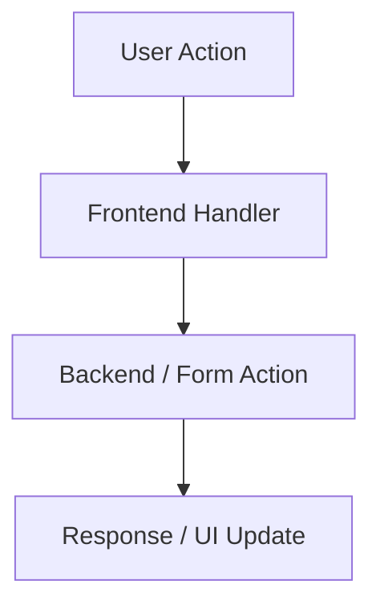

# Design: [FEATURE NAME]

> **Based on**: `specs/features/[category]/[feature-name]/requirements.md`
> **Created**: [DATE]
> **Status**: Draft

---

## 1. Proposed Schema / API Changes

- What data structures change?
- What endpoints / form actions are added or modified?
- What CSS / JS files are added or modified?

## 2. Data Flow

_(Replace with actual flow)_

## 3. Component Architecture Decisions

| Component | File | Responsibility |
|-----------|------|----------------|
| | | |

### Decisions & Rationale

- **Decision 1**: Why this approach over alternatives?
- **Decision 2**: What trade-offs were made?

## 4. Requirements Traceability

| Requirement ID | Design Element | Status |
|----------------|---------------|--------|
| [from requirements.md] | [how it's addressed] | Addressed |

---

_Generate this file after reading `requirements.md`. Verify all requirements are addressed before proceeding to `/plan-sdd`._
